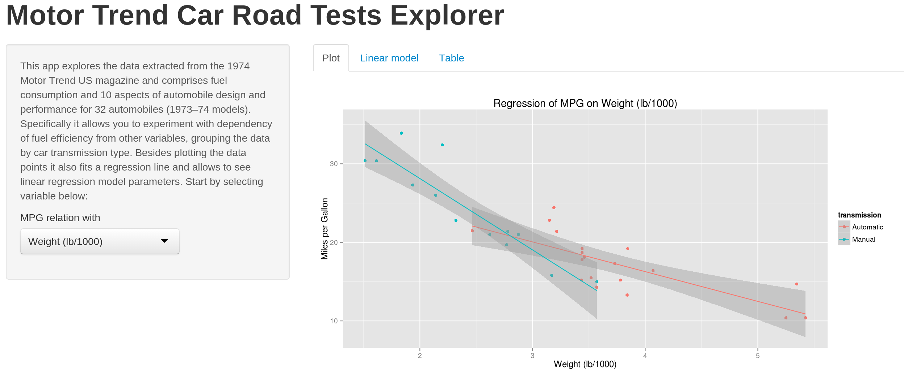

Shiny app for mtcars dataset exploration
========================================================
author: Ivan Kuznetsov
date: 2014-08-24
font-import: http://fonts.googleapis.com/css?family=Risque
font-family: 'Risque'
transition: rotate

Executive summary
========================================================
<small>
Whether automatic or manual transmission is better for MPG is a subject of heated debates.

We used data extracted from the 1974 Motor Trend US magazine that comprises fuel consumption and 10
aspects of automobile design and performance for 32 automobiles (1973–74 models) to offer our users
a possibility to visually and interactively explore the dependencies and make their own conclusions.
</small>

About mtcars dataset
========================================================

The data for this dataset was extracted from the 1974 Motor Trend US magazine, and comprises fuel consumption and 10 aspects of automobile design and performance for **32** automobiles (1973–74 models).

MPG values in this dataset range from **10.4** to **33.9** with the mean at **20.0906**.

Technology to build the product
========================================================

To build the interactive data exploration produt a web application framework for R - Shiny - was used.

Shiny helps to turn analyses into interactive web applications.

See [http://shiny.rstudio.com/](http://shiny.rstudio.com/) for more details about this technology.

What the final product looks like
========================================================

Here's a screenshot of the actual published product:

Product is available at [http://ivanku.shinyapps.io/shiny/](http://ivanku.shinyapps.io/shiny/)
